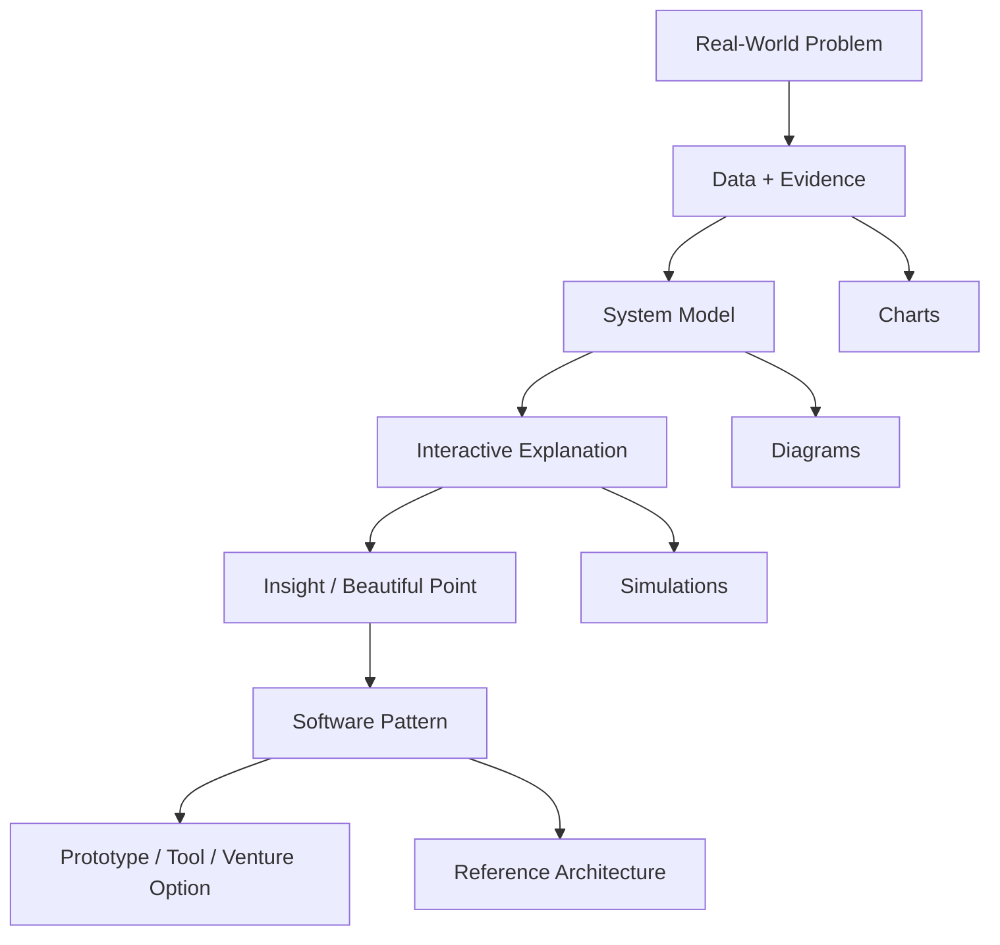

# Content System

The content system exists to keep publishing durable without turning every idea into a masterpiece.

## Site Sections

```text
abeautifulpoint.com
  Essays
    Systems
    Data
    AI
    Reliability
  Visuals
    Interactive explainers
    Infographics
    Diagrams
    Simulations
  Labs
    Small prototypes
    Open-source fragments
    Data notebooks
    Experiments
  Notes
    Reading notes
    Field notes
    Design sketches
  About
    Mission
    Principles
    Work with me
```

## Section Purposes

| Section | Purpose |
| --- | --- |
| Essays | Durable thinking |
| Visuals | Shareable interactive explanations |
| Labs | Prototype surface area |
| Notes | Lightweight publishing without perfectionism |
| About | Credibility plus future consulting or product bridge |

## Major Artifact Pattern

Each major piece should follow this shape:

1. The messy real-world problem.
2. The system map.
3. The data signal.
4. The beautiful point.
5. The software or system implication.
6. The action or design principle.

Example:

```text
Problem:
Incident response is noisy and slow.

System map:
Services, alerts, traces, logs, customers, teams, changes.

Data signal:
Failed customer interactions cluster into recurring patterns.

Beautiful point:
The useful unit is not the alert. It is the error pattern.

Software implication:
Build a pattern engine, not another dashboard.

Action:
Route recurring patterns to accountable owners with fix context.
```

## Visual Architecture



Identity:

> Problem -> Data -> System -> Visual Insight -> Software Pattern -> Action

## Artifact Types

### Visual Essay

Long-form essay with embedded diagrams and one clear systems argument.

### Interactive Explainer

A small interactive simulation or visualization that lets readers manipulate a system.

### System Map

A diagram-heavy breakdown of a domain, workflow, failure mode, or architecture.

### Field Note

A shorter 500 to 800 word observation with lower polish and faster publishing cadence.

## First Article And Artifact Ideas

1. The Beautiful Point Manifesto.
2. The Alert Is Not the Unit of Reliability.
3. Dashboards Are Not Decision Systems.
4. What Makes a System Legible?
5. From Logs to Meaning.
6. The Shape of an Incident.
7. The Causal Graph of Customer Pain.
8. Why AI Agents Need Semantic Maps.
9. The Factory, the Hospital, and the Data Center.
10. One Beautiful Point: The Leverage Point Hidden in a Messy System.

## First Homepage Copy

Hero:

```text
A Beautiful Point
Visual explanations for complex systems.
```

Subhero:

```text
I explore how data, software, and interactive infographics can make real-world systems easier to understand, operate, and improve - from reliability engineering to healthcare, manufacturing, infrastructure, and AI.
```

Calls to action:

- Start with the manifesto.
- Explore the visuals.
- Follow the lab notes.

Short about:

```text
A Beautiful Point is the public lab of Siew Wong, a software architect and SRE leader exploring the intersection of systems engineering, data intelligence, AI, and visual explanation.
```

## Publishing Cadence

Default cadence:

- One high-quality public artifact per month.
- Field notes when energy and signal are available.
- Larger prototypes only when they serve a clear essay or lab artifact.

## Quality Bar

Good artifacts are:

- Legible to an architect or operator.
- Specific enough to teach.
- General enough to avoid proprietary details.
- Visual because the system demands it, not because the page needs decoration.
- Practical enough to imply a design principle, tool, or next action.

